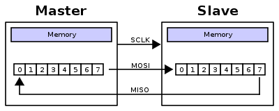

# ADC - DAC Description for Biomedical and Electrical Components

- Hardware
    - Microcontroller: ATMega328P (Atmel)
    - ADCs: 2 x ADS8688A (TI) - Bank 1 and Bank 2
    - DACs: 4 x AD5754 (ADI)
    - Op-amps: 16 x AD8625A (ADI)

- Software Description
    1) Declare class object of DAC AD5754 with 4ea of DACs, output scale values (+/-5V), chip select pin for SPI, and the number of communication to DACs
    
    2) Declare class object of ADC ADS8688A with chip select pin for SPI communication
        - One chip select pin is 5 and another one is 6
    
    3) When ~LDAC (Load DAC pin) is tied permanently low, the addressed DAC register is updated on the rising edge of ~SYNC pin.
    
    4) SPI communication is initialized - Imagine circular queue
        
    
    5) Set ADCs with each channel address like below
        
        - RANGE SELECT REGISTERS
        
                RG_Ch_0       0x05   // Channel 0 Input Range: default 0x00 - bit 3-0 to select range
                
                RG_Ch_1       0x06   // Channel 1 Input Range: default 0x00 - bit 3-0 to select range
                
                RG_Ch_2       0x07   // Channel 2 Input Range: default 0x00 - bit 3-0 to select range
                
                RG_Ch_3       0x08   // Channel 3 Input Range: default 0x00 - bit 3-0 to select range
                
                RG_Ch_4       0x09   // Channel 4 Input Range: default 0x00 - bit 3-0 to select range
               
                RG_Ch_5       0x0A   // Channel 5 Input Range: default 0x00 - bit 3-0 to select range
               
                RG_Ch_6       0x0B   // Channel 6 Input Range: default 0x00 - bit 3-0 to select range
               
                RG_Ch_7       0x0C   // Channel 7 Input Range: default 0x00 - bit 3-0 to select range
        
        - RANGE SELECTION
        
                R0            0x00   // Input range to -2.5/+2.5         Vref   +/- 10.24V
                
                R1            0x01   // Input range to -1.25/+1.25       Vref   +/-  5.12V
                
                R2            0x02   // Input range to -0.625/+0.625     Vref   +/-  2.56V
                
                R3            0x03   // Input range to -0.3125/+0.3125   Vref   +/-  1.28V
                
                R4            0x0B   // Input range to -0.15625/+0.15625 Vref   +/-  0.64V
                
                R5            0x05   // Input range to +2.5    Vref   10.24V
                
                R6            0x06   // Input range to +1.25   Vref    5.12V
                
                R7            0x07   // Input range to +0.625  Vref    2.56V
                
                R8            0x0F   // Input range to +0.3125 Vref    1.28V
    
    6) Auto Reset ADCs with AUTO_RST
        
        - NO_OP     0x00  // Continue operation in previous mode
           
        - STDBY     0x82  // Device is placed into standby mode
           
        - PWR_DN    0x83  // Device is powered down
        
        - RST       0x85  // Program register is reset to default
           
        - AUTO_RST  0xA0  // Auto mode enabled following a reset
        
    7) Error Check for ADCs   