# Cable Wiring Instruction

- PURPOSE
    - This instruction describes the method for wiring shielded and unshielded cables properly. 
    - This instruction describes how to clamp wires.
    - This instruction describes how to wire motors and syringe pumps correctly.
    - This instruction describes how to check and debug wiring correctly.
    

- REFERENCE, MATERALS, AND EQUIPMENT 
    - need below tools and items for wiring
        1) Wire stripper
        2) Shielded cable stripper
        3) Wire crimper
        4) Female or male crimp contact pin
        5) Shielded or unshielded cables
    
    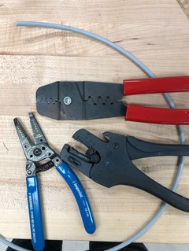

    - need multi-meter for checking wires, setting continuity check mode like below.
    
    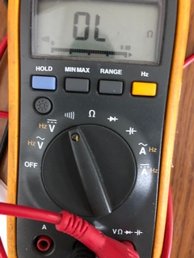
    
    - have three types of cables
        1) igus chainflex CF240-PUR-03-04, 4 x 22 AWG
        https://www.igus.com/product/1072
        
        2)  Carol C1331-1000-ND, 1331A.41.10, 4 x 20AWG
        http://general-cable.dcatalog.com/v/Electronics/?page=170
        
        3) R20007-1T, 2 x 22AWG

- PROCEDURE 
    - How to clamp wires
        - Strip shield of cable with the stripper like below.
        
        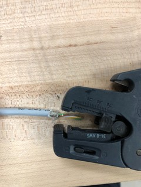
        
        - Strip wires with wire stripper. Since we have 20AWG and 22AWG cables, you should strip the insulation, matching with wire size.
        
        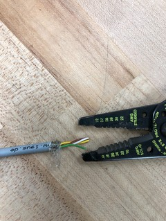
        
        - Place one of wires in crimp contact pin like below. Crimp contact pin has two cripming points. Insulation should be placed at the left crimping point and metal wire should be placed at the right crimping point.
        
        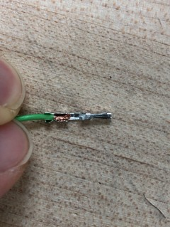
        
        - Clamp two crimping points and check whether it is properly clamped by pulling  back the wire.
        
        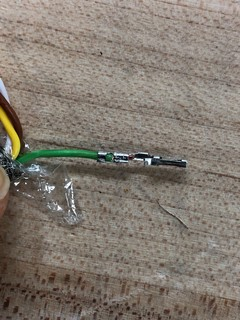
        
        - Insert male or female crimp pin into connector all the way, latching the crimp pin to small square hall at the connector like below.
        
        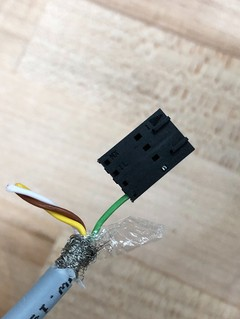
        
    - How to wire motors and syringe pumps correctly
        - Main board pin configuration
      
        We have two types of main boards and the motor pin order is same like below.
        If a latch of connector is upward, the motor pin order is ‘B1 – B2 – A2 – A1’ .
        You can understand ‘A1 – A+’, ‘A2 – A-’, ‘B1 – B+’, and ‘B2 – B-’.
       
        1) Previous version of main board
        
        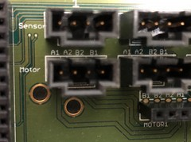
      
        2) New version of main board
        
        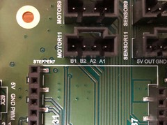
      
    - Syringe pump pin configuration
      
    Based on pin configuration in datasheet, you should wire ‘Green – A1 in main board’,  ‘Blue – A2 in main board’, ‘Red – B1 in main board’, and ‘Black – B2 in main board’.
    
    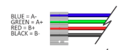
    
    - Motor pin configuration
      
    Since we have various kinds of motors, you should check the datasheet of motors, you are supposed to wire, and match pin cofiguration
    For example, the motor we use for integrated reader module has below pin configuration.
    
    https://lin-web.s3.amazonaws.com/downloads/products/hybrid-stepper-motors/Motor%20Connection%20Wiring%20Diagram.pdf
    
    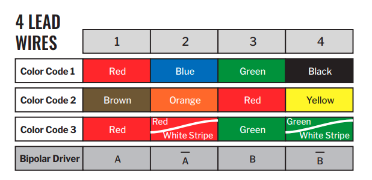
    
    Based on pin configuration in datasheet, you should wire ‘Red – A1 in main board’,  ‘Blue – A2 in main board’, ‘Green – B1 in main board’, and ‘Black – B2 in main board’.
    
    In addition, we have ‘Sepper Motor Nema 17’. It has different wiring configuration like below. In this case, you should wire ‘Black – A1 in main board’,  ‘Green – A2 in main board’, ‘Red – B1 in main board’, and ‘Blue – B2 in main board’.
    
    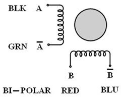
    
    Motor wiring procedure should be conducted based on datasheet of motors and main board pin order. You should find the datasheet of motors to wire cables.
    
- How to check and debug wires
    - We have been troubled with wiring physical and electrical issues. For example, wire was come off physically from connector or wire was broken or cracked. Below photos are the examples of the issue.

        - Red wire came off
        
        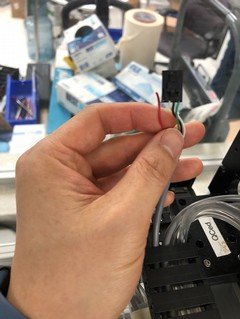
        
        - Red wire was cut
        
        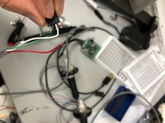
        
        - Black and blue wires came off
        
        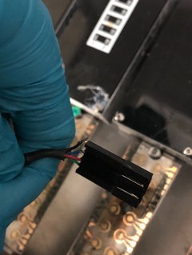
    
        - White Insulation was cracked 
        
        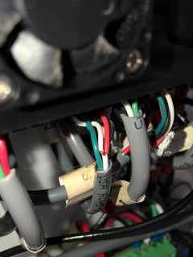

    - Physical Check Procedure

        - Inspect visually whether there are cracked or broken wires like above photos. 
        
        - Pull back each wire to confirm the latch of a crimp contact pin is properly placed. For example, below photo shows that white wire is pulled back.
		
		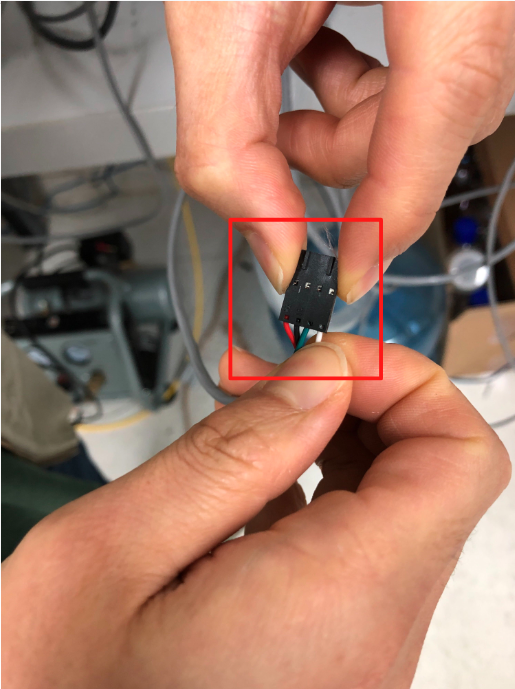
	    
	    - Check whether cables are correctly connected, matching the components’ wiring  	pin order in the components’ datasheet and pin order in main board. You can refer 	to above section of ‘How to wire motors and syringe pumps correctly’.
	    	
	- Electrical Check Procedure

        - Check continuity between each end of wires with multi-meter. If it is not broken 	or cracked, multi-meter should beep. For example, below photo shows checking 	continuity of white wire.
        
        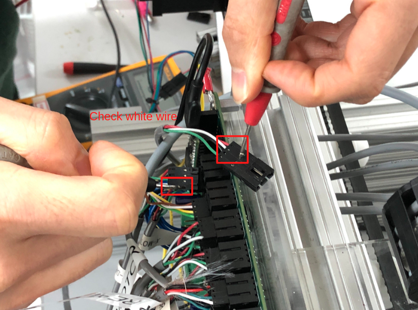
		
		- If the wiring is fine eletrically and physically, in case of old version of main 	board, you should check the current regulation. New version main board can set t	he current regulation of each motor driver based on software. Old version of main 	board should be set by variable resistor like below.
        
        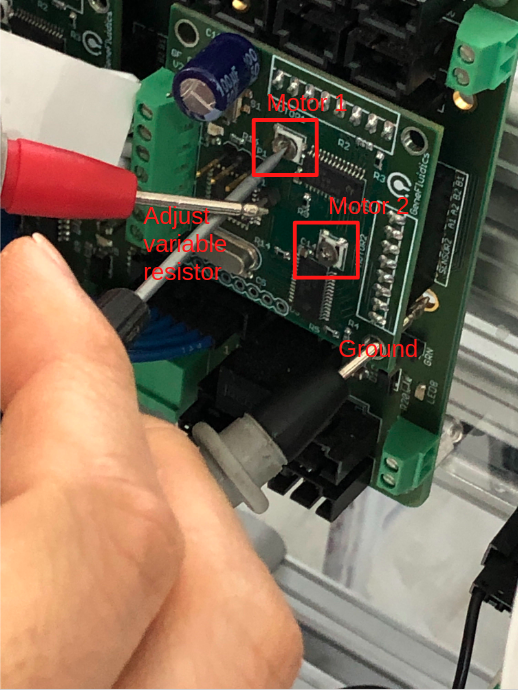

    
